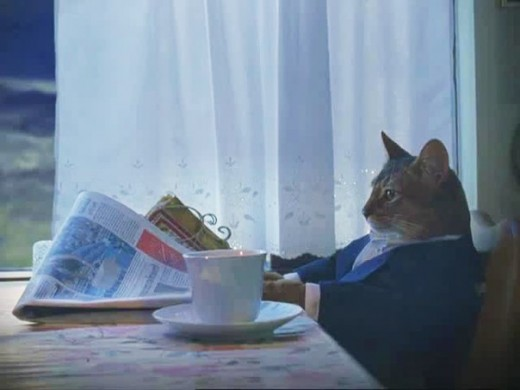
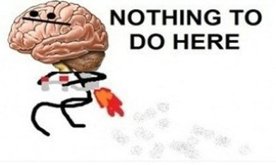
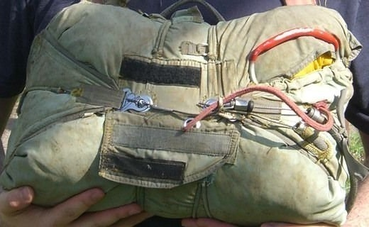
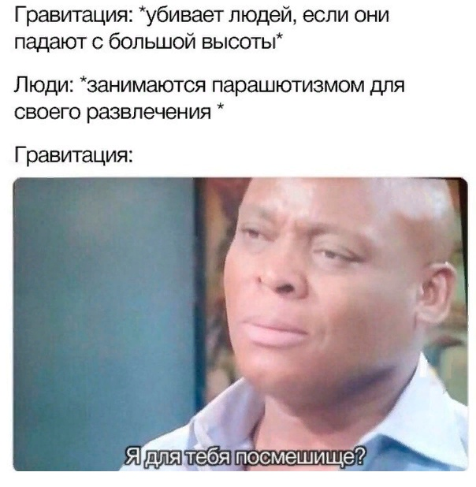

# Как я прыгнул с парашюта

Бывало ли у тебя так, что сидишь утром, пьёшь горячий чай\кофе\иной напиток, и думаешь о том, когда последний раз ты совершал что-либо экстримальное, неординарное, о чём точно будешь вспоминать в старости, если доживёшь?
Примерно как кот на картинке.

И у меня нет. Однако в прошлые выходные я прыгнул с парашютом, о чём точно буду помнить всегда. По крайней мере, пока память мне не откажет.

## А не пиздишь ли ты часом? Где пруфы, Билли?
Из-за технических и людских неполадок, нет полной записи моего прыжка. Единственное, что записалось - это то, как я вываливаюсь из самолёта.

[Видеопруф](https://www.dropbox.com/s/0noh382n62aiyfk/max_jump.mp4?dl=0)

И да, я слишком ленив, а мой комп слишком слоупок, чтобы делать такое с помощью Deepfakes.

И нет, я не пьяный, подробности будут ниже.

## Как тебе такое вообще пришло в голову?
Было несколько причин:
- я ни разу не летал на самолёте, а платить 16к за полёт на як-52 - что-то не очень хотелось.
- желание запоминающе закончить свой 25 год.
- жажда новых эмоций.
- сделать что-то, чем можно было бы хвастаться.
- ~~мне хотелось как-нибудь красиво уйти из жизни~~

## Безопасность

Сразу скажу, чтобы никто не пытался даже - суициднуться тут не получится (если только ты специально не будешь портить оборудование).

Основной парашют имеет механизм авторастрытия: если ты после 3 секунд не дёрнул кольцо, то спустя секунду он раскроется сам.
Кроме того, есть запасной парашют, который имеет точно такой-же механизм, который срабатывает на 300 метрах.

~~Так что пошли лучше за двумя гвоздями в магазин.~~ Так что никакого суецыда.

## Ты боялся? Было страшно?
И нет, и да.

Фактически всё время до посадки в самолёт и взлёта я воспринимал это довольно абстрактно. Отчасти от того, что я фактически никогда не смотрел вертикально вниз выше, чем с высоты 3 этажа. 

"Ну прыжок, ну с самолёта, ну с высоты. Чего тут бояться?"

Многие, кто прыгал со мной с самого утра были на взводе, а уж когда пилоты завели самолёт, и когда на нас нацепили экипировку, и мы стояли ждали, чтобы погрузиться в самолёт - там уж у многих нервы сдавали.

Хотя тут стоит заметить, что хоть и до определённого момента (об этом ниже) я не ощущал волнения, но проснулся я в этот день в 3 ночи. И самым моим большим страхом было то, что я засну, когда буду лететь на парашюте, и не успею насладиться и осмотреться.

## Подготовка

В тот день с нами должны были прыгать кадеты из Томской застывы - подростки в возрасте 14-16 лет.
Вместе с ними мы сначала около 4 десятков раз репетировали весь порядок действий при отделении от самолёта. 

А потом начали отрабатывать приземление - прыгали сначала с высоты ~пол метра, и постепенно повышая до 2 метров (как говорят инструктора, приземление при прыжке по нагрузке и силе удара равносильно прыжку с высоты 2 метров).

Поначалу было немного не круто себя чувствовать, когда около тебя стоит 14 летняя девочка, которая выполняет все упражнения идеально, а потом ты узнаёшь, что она уже 2 раза прыгала.

> Если у тебя есть дети подростки, или есть знакомые, у которых дети в возрасте 12-16, то на остаток лета их можно сплавить вот сюда: [Томская застава](https://vk.com/tomskzastava). Судя по описанию, довольно таки крутое место, если отключить функцию религии. Сам бы сейчас туда пошёл, но меня не пускают.

Но потом из-за задержки взлётов им пришлось покинуть аэродром, поэтому мы прыгали без них. А жаль. Там среди них был негр...

## Взёт
Погружение в самолёт мы репетировали на подготовке, так что тут всё хорошо было. А дальше, самолёт стал взлетать и набирать высоту, и всё это время смотрел в иллюминатор, потому что это был мой первый полёт(!!!). И тут мо мной произошло несколько немного неприятных вещей:
1. меня стало сильно тошнить. но тут возможно виноват и фруктовый батончик, который был заточен за пол часа до прыжка, ибо я с 7 утра не ел ничего (а прыжок был в районе 15). А может просто потому что этот кукурузник сильно качало в воздухе.
1. от давления стали "стрелять" уши.
1. мой внутренний диалог, который обычно говорит мне всякие мотивирующие цитатки в стиле Джейсона Стетхема, вдруг сменил тематику, и стал шептать следующее: 
> Макс, ты что, ебанулся? Ты реально будешь прыгать отсюда? Какой нормальный человек будет выпрыгивать из нормально работаюшего самолёта? Ты шо, ебобо?

Наверное, это связано с тем, что деревья вдруг стали однопиксельными, а дачные дома - группой из 8 пикселей.

От всего этого меня раздирало смехом. В итоге все сидят напряжённые, а я сижу, смотрю в иллюминатор и ржу, как идиот.

## Прыжок
Я прыгал в первом взлёте, и был первым в первой тройке.
> Тут стоит немного рассказать про принцип организации прыжков. Прыгающие делятся на взлёты по 9-10 человек - больше в самолёте нет места, + инструктор. Люди во взлёте сортируются по весу: от тяжелых к лёгким, и в таком порядке прыгают, чтобы в воздухе тяжёлый не догнал лёгкого. В каждом взлёте первый человек прыгает один, а остальные - по тройкам. Этот первые прыгающий человек называется "мясо" - по нему "прицеливаются", чтобы парашютисты приземлялись строго в определённую зону высадки, а не в лес. 

Поэтому мне посчастливилось около полминуты стоять в готовности около открытой двери кабины самолёта.
Когда так стоишь и смотришь вниз, единственное, что делает твой мозг, вот это:

Физически там нечего бояться, т.е. повредиться ты особо не сможешь. Тут все дело именно во внутреннем страхе. Как он изводит тебя, как ты пытаешься его преодолеть. Это очень сильно чистит голову. По крайней мере мне.

## Отделение

Ты делаешь шаг в пропасть, и всё. 

Неоднократно себе представлял, как прыгаю с самолёта, наслаждаюсь свободным падением 3 секунды, смотрю вниз, чувствую гравитацию, чувствую, как потоки воздуха обтекают меня...oh, my little baby boy...

На видео было немного видно, как меня шарашит из стороны в сторону после прыжка. Это лишь малая часть из всего. Потоки воздуха очень сильно шумят, что ещё сильнее мешает сосредоточиться. Благодаря стабилизатору (небольшой парашютик, который раскрвается при отделении от самолёта) ты хоть сохраняешь вертикальное положение, но всё равно дико растерян от всего проиходящего.

Из-за всего этого, ну и того, что разум меня покинул на прошлом этапе, воприятие времени то замедляется, то ускоряется, а в голове только мысли:
> АААААААСУКАПИЗДЕЦЧТОТАМДЕЛАТЬТОНАДО? ПЯТЬСОТДВАДЦАТЬОДИН! ПЯТЬСОТДВАДЦАТЬДВА! ПЯТЬСОТДВЕДЦАТЬТРИ! КОЛЬЦО!

Дергаю кольцо. И.... ничего.... Если раньше время вопринималось как ускоренное, то теперь оно было как замедленное. Мне казалось, что прошло секунд 5-7, а парашюта всё не было (момент раскрытия парашюта ощущается как небольшой динамический удар). Хотя на деле прошло менее секунды.

> ПЯТЬСОТДВАДЦАТЬЧЕТЫРЕ! ПЯТЬСОТДВАДЦАТЬПЯТЬ! КУПОЛ!

И тут наконец-то я прочувствовал его раскрытие. Падение замедлилось. Вместе с ним и поток шума в голове. Поднимаю голову - вот он родненький, весь раксрытый белый красавец.

В этот момент моим главным желанием было то, чтобы меня не вырвало. Но спустя буквально несколько секунд всё прошло.

Дальше повертелся по сторонам - это было наудивление легко.

> СТРОПИЧКА!

Всё тут написано капсом, потому что это всё кричалось. Не уверен, что это нужно для того, чтобы соседи услышали, и тоже не забыли вытащить стропичку, а скорее всего для того, чтобы ты сам себя услышал.

>> Опять небольшой ликбез. Стропичка - так называют небольшую красную верёвочку, часть специальной стропы запасного парашюта, с помощью которой происходит его раскрытие с помощью страховочного автомата. После раскрытия основного парашюта нужно убедиться в том, что он раскрылся, и полностью исправен. После чего нужно вынуть это стропичку из петли, тем самым отключив автоматическое раскрытие запасного парашюта (прибор всё равно сработает на высоте 300 метров, но уже ничего не произойдёт).
На фото ниже видно красное круглое кольцо, и ниже него красный шнур - стропичка, которая продета в белую петлю. Вот этот шнур из этой петли и нужно вынуть.
> 

После всех этих манипуляций нужно было делать лишь одно - наслаждаться видом.

Тут в очередной раз стоит вспомнить одну поговорку:
>  В экстренный момент ты не поднимишься до уровня своего ожидания, а опустишься до уровня своей подготовки.

## Планирование

## Приземление
Вот это самая опасная часть всего прыжка. Если до этого от тебя ничего не зависит, ты просто выполняешь всё по инструкции, а если не выполнил, то автоматика тебя подстрахует, то тут нужно положиться только на себя, ведь никто тебе не поможет.

У меня приземления получилось, как мне показалось, мягкое. 
"Мясо", который прыгал до меня, сломал себе ногу на приземлении из-за того, что его развернул ветер, и он приземлялся боком.

## А что, если я в самолёте передумаю прыгать?

Наши доблестные инструктора с пониманием относятся к любым пожеланиям перворазников.

[Пошёл пошёл пошёл](https://www.dropbox.com/s/0zoivckilwaycf3/1_poshol.mp4?dl=0)

[Нам нельзя](https://www.dropbox.com/s/y77wmxi21z9dbpy/2_tolkal.mp4?dl=0)

## Кому посоветуешь?
Всем. Абсолютно. Если только у тебя нет дикого панического страха высоты. 

Каждый из опыта прыжка выносит для себя свой опыт.
Кто-то вспоминает фразу "рождённый ползать летать не может". 
Кто-то наоборот: "я человек - повелитель стихий". Согласно байкам инстуркторов, половина перворазников "заболевает" парашютным спортом.
Даже если тебе не понравится, всё равно не будет лишним повод выпить 26 июля - в день парашютиста.
Ну и повыпендриваться перед друзьями - бесценно :)

## Что это тебе дало?
Лично я изменил своё отношение к страху. 

Физически там нечего бояться, т.е. повредиться ты особо не сможешь. Тут все дело именно во внутреннем страхе. Как он изводит тебя, как ты пытаешься его преодолеть. Это очень сильно чистит голову. По крайней мере мне.

## Ещё будешь прыгать?

>"Если с первого раза не получилось - то парашютный спорт не для вас" (с)

У меня получилось. 

## Я тоже хочу! Сколько стоит? Как записаться?
Вот [группа вконтакте](https://vk.com/tomskskydive)
Они тут всегда пишут анонсы прыжков.

Прыжок стоит 4000. (3700 прыжок + 300 страховка).

Просто приходишь в четверг на инструктаж (девушкам желательно одеть брюки), который длится около 4 часов, а потом в субботу с утра опять идёт курс практической подготовки, после чего сами прыжки. Но опять же, всё зависит от погоды (или длинны пробки, в которой стоят пилоты). Мы приехали на аэродром в пол 9, и начали прыжки только около 15.

Летом он прыгают до сентября, так что у тебя ещё месяц с хвостиком чтобы успеть.

## Дополнительный материал:

- https://youtu.be/2tKt0yfI25o
- https://youtu.be/GTXBBDBQ5ek
- https://youtu.be/c9k1fVG7rFA
- https://youtu.be/2YCpROSS7KU
